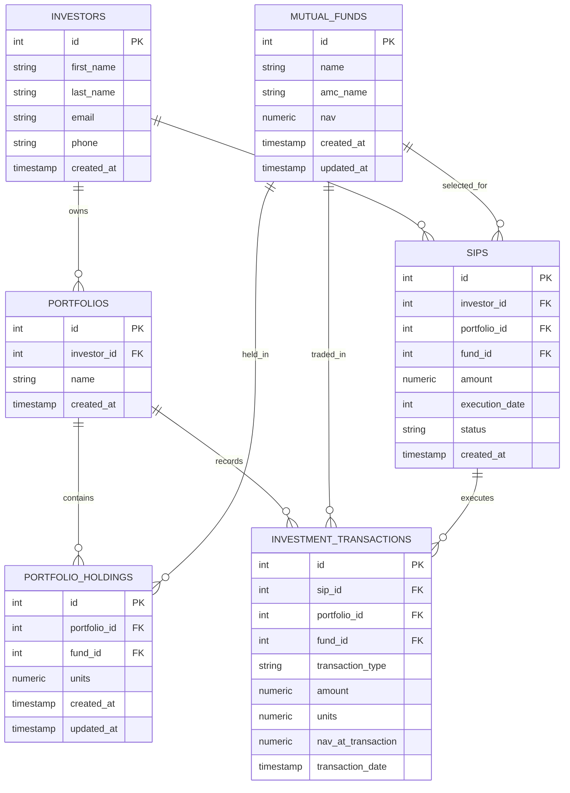

# Entity-Relationship Diagram

```mermaid
erDiagram
    INVESTORS ||--o{ PORTFOLIOS : owns
    INVESTORS ||--o{ SIPS : registers
    
    PORTFOLIOS ||--o{ PORTFOLIO_HOLDINGS : contains
    PORTFOLIOS ||--o{ INVESTMENT_TRANSACTIONS : records
    
    MUTUAL_FUNDS ||--o{ PORTFOLIO_HOLDINGS : held_in
    MUTUAL_FUNDS ||--o{ SIPS : selected_for
    MUTUAL_FUNDS ||--o{ INVESTMENT_TRANSACTIONS : traded_in
    
    SIPS ||--o{ INVESTMENT_TRANSACTIONS : executes
    
    INVESTORS {
        int id PK
        string first_name
        string last_name
        string email
        string phone
        timestamp created_at
    }
    
    MUTUAL_FUNDS {
        int id PK
        string name
        string amc_name
        numeric nav
        timestamp created_at
        timestamp updated_at
    }
    
    PORTFOLIOS {
        int id PK
        int investor_id FK
        string name
        timestamp created_at
    }
    
    PORTFOLIO_HOLDINGS {
        int id PK
        int portfolio_id FK
        int fund_id FK
        numeric units
        timestamp created_at
        timestamp updated_at
    }
    
    SIPS {
        int id PK
        int investor_id FK
        int portfolio_id FK
        int fund_id FK
        numeric amount
        int execution_date
        string status
        timestamp created_at
    }
    
    INVESTMENT_TRANSACTIONS {
        int id PK
        int sip_id FK
        int portfolio_id FK
        int fund_id FK
        string transaction_type
        numeric amount
        numeric units
        numeric nav_at_transaction
        timestamp transaction_date
    }
```
